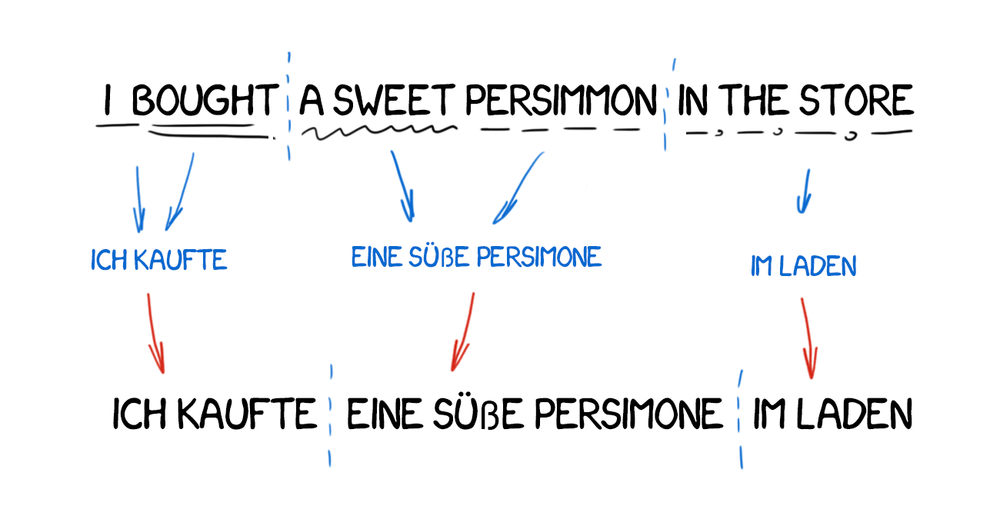

# Natural Language Processing

Natural Language Processing or NLP is a field of Artificial Intelligence that gives the machines the ability to read, understand and derive meaning from human languages.

## Sentiment Analysis

Sentiment analysis (or opinion mining) uses NLP to determine whether data is positive, negative or neutral. Sentiment analysis is often performed on textual data to help businesses monitor brand and product sentiment in customer feedback, and understand customer needs.

## Machine Transaltion

Machine Translation (MT) is a task in Natural Language Processing (NLP), where systems are used to automatically translate any text from one
language to another while preserving the meaning of the source text.

